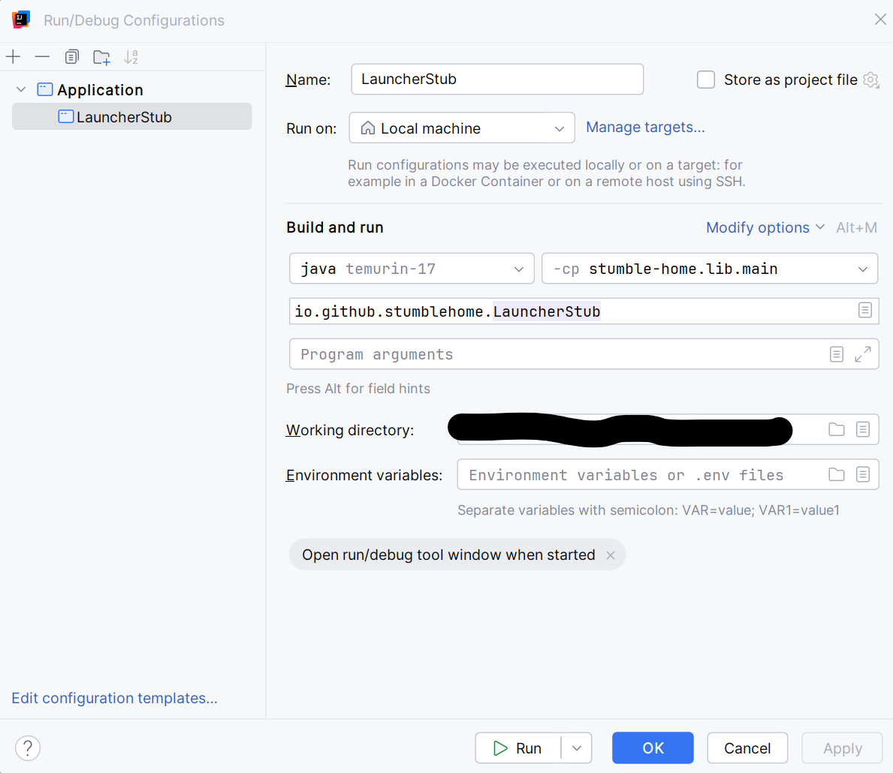

# Stumble-Home

Repository for developing video game. Cohort 3, Team 8.

-----------------------------------------------------------------------
Note you must use **Adoptium's Temurin® Java 17**:

- To test you are using the right version, run the file: **CheckJDKVersion.java**
    - Expect results like this:
        - Java Version: 17.0.16
        - Java Vendor: Eclipse Adoptium

-----------------------------------------------------------------------
Commit Standards:

- **Type: Message**
    - Type:
        - **feat** - changes that add a feature or modify one
        - **fix**  - changes that fix bugs or issues
        - **doc**  - changes to documentation
        - **conf**  - changes to file structure
        - **test** - changes to code tests
        - **dep** - changes to dependencies

    - Message: short explaining change
- Example:
    - *fix: data validation bug corrected*

-----------------------------------------------------------------------

Names:

- Henry G
- Lenny S
- Isaac M
- Andri K
- Rishi T
- Ida K
- Viktor B

-----------------------------------------------------------------------

## Build & Run

This repository provides a minimal runnable distribution: the `lib` module is built into a single runnable jar that
includes the LWJGL3 backend and native desktop libraries.

For full build, formatting, and contribution instructions see `CONTRIBUTING.md`.

### Running from source

Build the project (runs checks and tests):

```bash
# from repository root
cd StumbleHome
./gradlew build

# then run the produced jar (artifact under lib/build/libs/)
java -jar lib/build/libs/StumbleHome-1.0.0.jar
```

### Running in IntelliJ
- Run the gradle setup task when prompted
- Then navigate to **Edit Configurations**:
  - Set **cp** to **stumble-hom.lib.main**
  - Click select main class:  
    - Tick **Include non-project items**
    - Search for **io.github.stumblehome.LauncherStub**
    - Select and save settings

    
    

### Downloading latest source version

A pre-built artifact for the latest commit may be available via the repository's GitHub Actions run artifacts.
To download the latest successful build artifact:

1. Open the repository on GitHub.
2. Click the "Actions" tab.
3. Select the most recent successful workflow run.
4. In that run's summary, open the "Artifacts" section and download the `StumbleHome` artifact.

Notes:

- The produced JAR is at `StumbleHome/lib/build/libs/StumbleHome-<version>.jar` where `<version>` is set in
  `StumbleHome/gradle.properties` (`projectVersion`).
