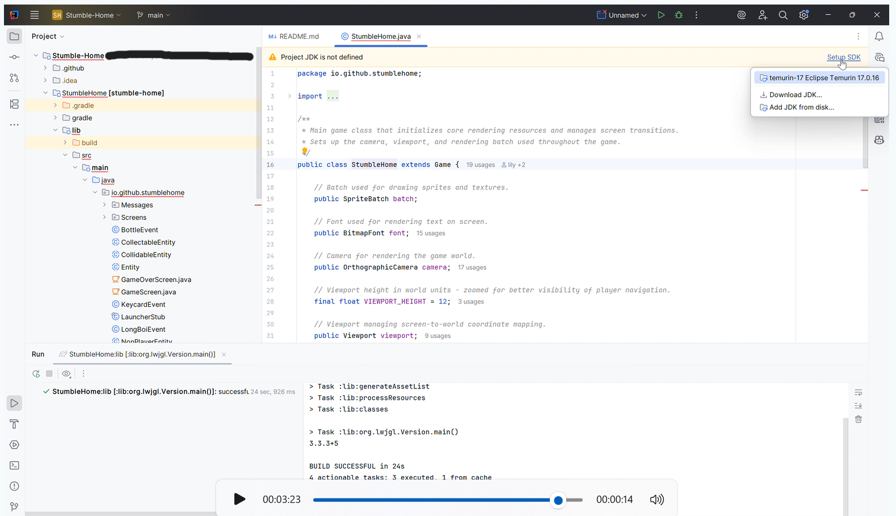
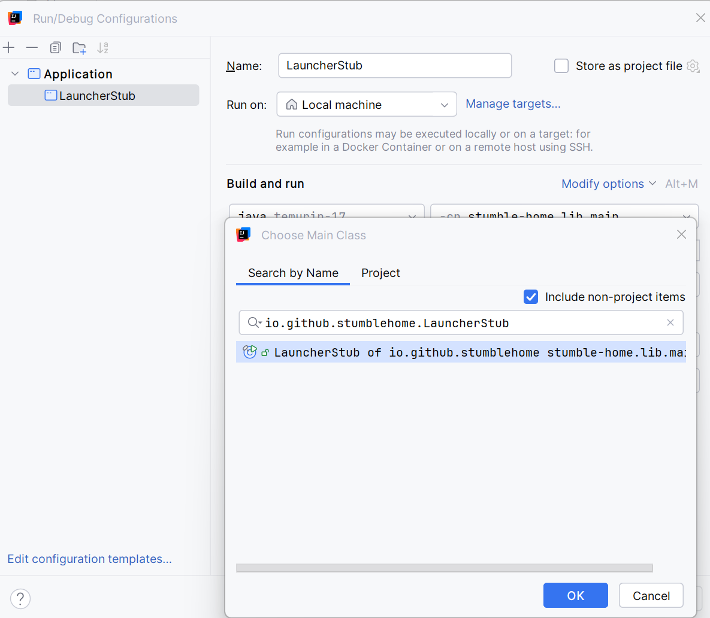

# Stumble-Home

Repository for developing video game. Cohort 3, Team 8.

-----------------------------------------------------------------------
Note you must use **Adoptium's Temurin® Java 17**:

- To test you are using the right version, run the file [Check_Java_Version.java](./src/CheckJDKVersion.java)
    - Expect results like this:
        - Java Version: 17.0.16
        - Java Vendor: Eclipse Adoptium

-----------------------------------------------------------------------
Commit Standards:

- **Type: Message**
    - Type:
        - **feat** - changes that add a feature or modify one
        - **fix**  - changes that fix bugs or issues
        - **doc**  - changes to documentation
        - **conf**  - changes to file structure
        - **test** - changes to code tests
        - **dep** - changes to dependencies

    - Message: short explaining change
- Example:
    - *fix: data validation bug corrected*

-----------------------------------------------------------------------

Names:

- Henry G
- Lenny S
- Isaac M
- Andri K
- Rishi T
- Ida K
- Viktor B

-----------------------------------------------------------------------

## Build & Run

This repository provides a minimal runnable distribution: the `lib` module is built into a single runnable jar that
includes the LWJGL3 backend and native desktop libraries.

For full build, formatting, and contribution instructions see `CONTRIBUTING.md`.

### Running from source

Build the project (runs checks and tests):

```bash
# from repository root
cd StumbleHome
./gradlew build

# then run the produced jar (artifact under lib/build/libs/)
java -jar lib/build/libs/StumbleHome-1.0.0.jar
```

### Running in IntelliJ
- Run the gradle setup task when prompted
- Navigate to **StumbleHome/lib/src/main/java/io/github/stumblehome/StumbleHome.java**  
  - With the file open (any java file in here will do):
    - Select **Setup SDK** at the top of the file (in the **Project JDK is not defined** bar)
    - Select **temurin-17 Eclipse Temirin 17.0.16**
    (or equivalent)

    

- Then navigate to **Edit Configurations**  
Found under the drop down box **Current File** (next to the **run** button):
  - Set **cp** to **stumble-hom.lib.main**
  - Click select main class:  
    - Tick **Include non-project items**
    - Search for **io.github.stumblehome.LauncherStub**
    - Select and save settings

    
    


### Downloading latest release version

Pre-built artefacts for released versions are available via the repository's [GitHub Releases](https://github.com/eng1-team3-8/Stumble-Home/releases) page.

Stable versions are released as jar executables compatible on Windows, MacOS, and Linux. Accompanying application bundles are also available for MacOS.

Unstable versions are marked as pre-release, and tagged as version X.X.X-dev . Only JARs are available for development builds.

Visit the releases page for installation and usage instructions.

### Downloading latest source version

Pre-built artefacts for the latest commit may be available via the repository's [GitHub Actions](https://github.com/eng1-team3-8/Stumble-Home/actions) run artefacts.

1. Select the most recent successful workflow run.
2. In that run's summary, open the "Artifacts" section and download the `universal-jar` artefact.
